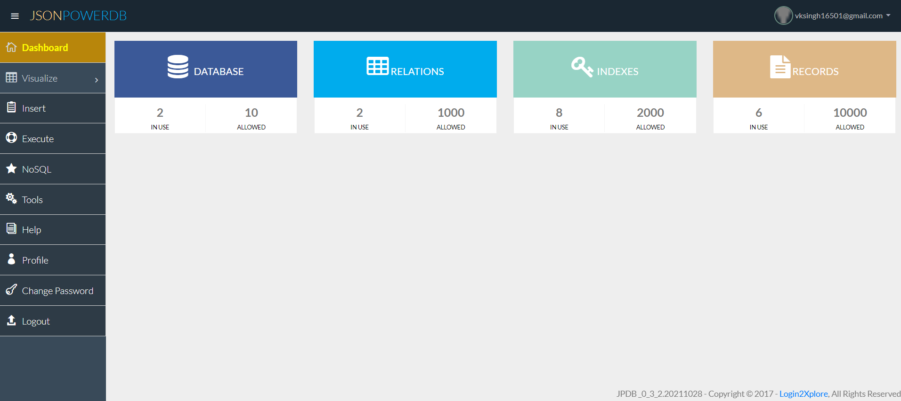

# JsonPowerDB
Performing CRUD operation on JsonPowerDB built on top of one of the fastest and real-time data indexing engine - PowerIndex.

## Benefit of using JasonPowerDB
- Schema-free, Simple to use, Nimble and In-Memory database
- Serverless,simple to use
- It is raw data and can be read directly by machine and human(which makes it faster)
- By import jpdb-commans.js the code become shorter

###Screenshot of my work on JsonPower DB

